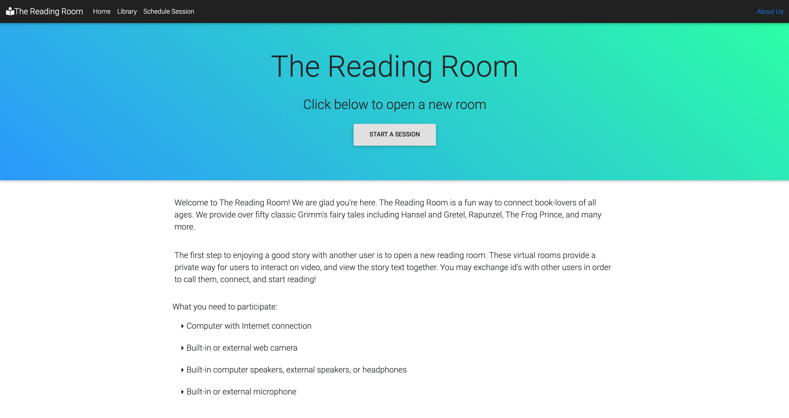

# :books: The Reading Room

The Reading Room is a fun way to connect book lovers of all ages, even in times of social distancing.  The app provides peer-to-peer video and audio streaming.  A young listener can quickly connect with an older adult reader, and both parties can read along with the book text as it streams across their screen.  Users have access to over fifty classic Grim's Fairy Tale stories.  The option to schedule sessions ahead-of-time is also available.  The Reading Room doesn't require users to sign up for an account, which can be a time-consuming obstacle for very young or very old users.  Instead, the reader and listener are both provided with a unique link that they can immediately visit in their browser.

## :rocket: Built with the help of:
- [Heroku](https://www.heroku.com/)
- [Node.js](https://nodejs.org/en/)
- [Express](https://expressjs.com/)
- [Handlebars](https://handlebarsjs.com/)
- [Bootstrap](https://getbootstrap.com/)
- [MySQL](https://www.mysql.com/)
- [PeerJs](https://peerjs.com/)
- [jQuery](https://jquery.com/)
- [Project Gutenberg](https://www.gutenberg.org/files/2591/2591-h/2591-h.htm)
- [Nodemailer](https://nodemailer.com/about/)

## ♀️ Authors
- [Mae LaPresta](https://github.com/mlapresta)
- [Manda Jensen](https://github.com/mp-jensen)
- [Elizabeth Tackett](https://github.com/emtackett)

## :earth_americas: View on the web:
[The Reading Room](https://reading-room.herokuapp.com) is hosted by Heroku.

## 💻 Work locally:
- Clone the repository: `git clone https://github.com/emctackett/reading-room.git`
- From the command line, navigate into the `reading-room` directory.
- run `npm install`.
- run `npm start`.
- Visit port `:4000` in your browser.
